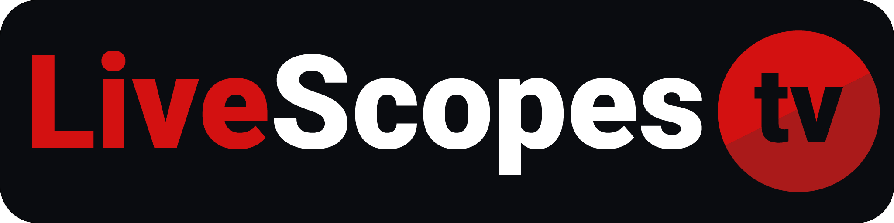

</img>
<h2 align="center"> <b>LiveScopes.tv</b></h1>

<a href="https://ndi.tv">NDI®</a> enabled windows tool for real time <a href="https://github.com/MindStudioOfficial/livescopestv#waveformsscopes">Waveforms/Scopes</a>

 

The free version of LiveScopes.tv is now part of the PRO version and can be found over at [broadcasttools.de](https://broadcasttools.de/livescopes-tv-by-mindstudio/download-livescopes-tv/).

New releases will only be published on the website. The old releases will still be available here on GitHub for reference.

## Download

Visit [broadcasttools.de/livescopes-tv-by-mindstudio/download-livescopes-tv/](https://broadcasttools.de/livescopes-tv-by-mindstudio/download-livescopes-tv/) to download the latest version.

## Documentation

Visit [docs.mindstudio.tv](https://docs.mindstudio.tv/) for the regularly updated documentation, getting started guides, and more.

## Author

developed by [**Marc Bach** _"MindStudio"_](https://github.com/MindStudioOfficial/)

 

*NDI® is a registered trademark of Vizrt Group.*